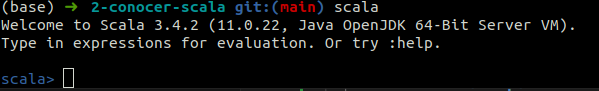
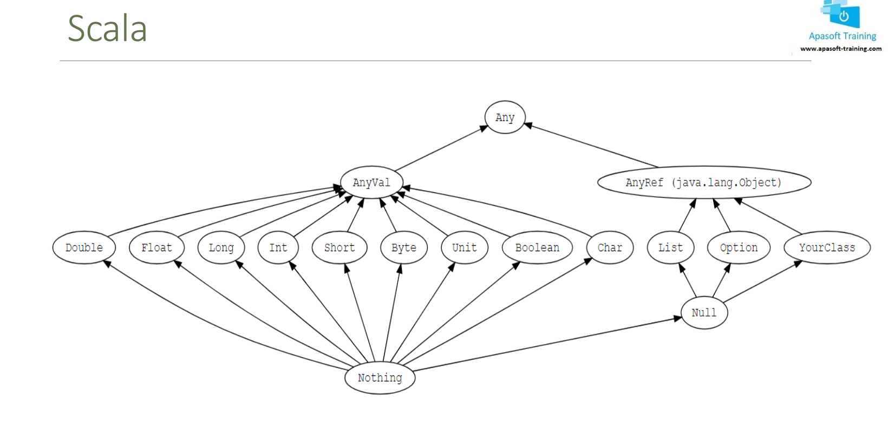
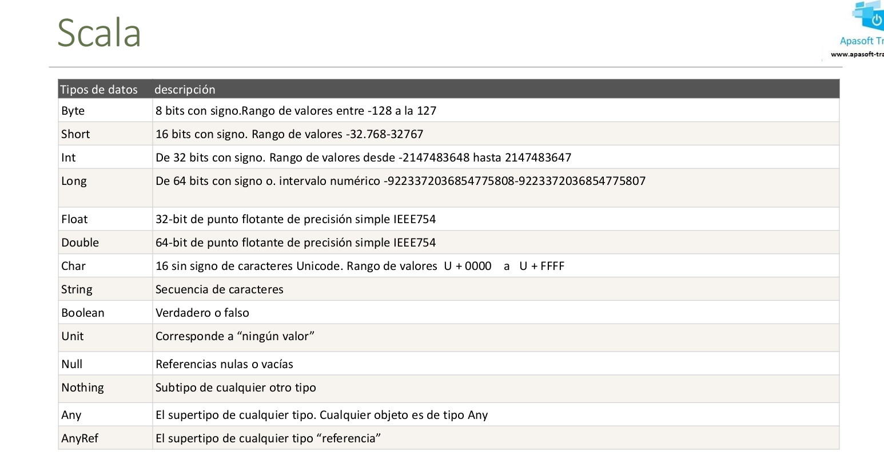
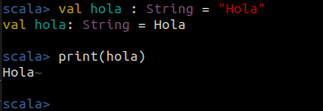
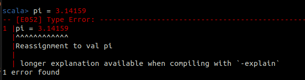
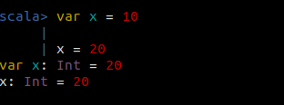
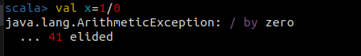
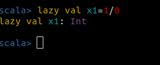
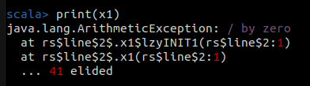

# 2-conocer-scala
1. [Introducción a REPL. Herramienta en modo comando](#schema1)
2. [Tipos de Datos](#schema2)
3. [VAR y VAL. Variables](#schema3)
4. [Crear variable en modo Lazy](#schema4)
5. [Comentarios](#schema5)
6. [Operadores](#schema6)

<hr>

<a name="schema1"></a>

## 1. Introducción a REPL. Herramienta en modo comando


### **REPL**
- Significa `Read-Eval-Print Loop (Bucle Leer-Evaluar-Imprimir)`, y es una característica común en muchos lenguajes de programación, incluido Scala. Un REPL proporciona un entorno interactivo donde puedes escribir código, ejecutarlo inmediatamente, ver los resultados y luego escribir más código.

- Aquí está cómo funciona el proceso en un REPL:

    - **Leer (Read):** El REPL lee la entrada del usuario, que puede ser una expresión, una declaración o un comando.

    - **Evaluar (Evaluate):** Luego, el REPL evalúa la entrada del usuario, es decir, interpreta y ejecuta la entrada.

    - **Imprimir (Print):** Después de evaluar la entrada, el REPL imprime el resultado de la evaluación en la pantalla.

    - **Bucle (Loop):** Una vez que se completa la evaluación y la impresión, el REPL regresa al paso de lectura, donde espera la siguiente entrada del usuario. Este proceso se repite continuamente, de ahí el término "bucle".

En el contexto de Scala, puedes iniciar el REPL de Scala ejecutando el comando `scala` en tu terminal. Esto abrirá una sesión interactiva donde puedes escribir y ejecutar código Scala directamente en la terminal.




<hr>

<a name="schema2"></a>

## 2. Tipos de Datos




<hr>

<a name="schema3"></a>

## 3. VAR y VAL. Variables


## Declarar Variables

**val nombre_variable : tipo_datos = valor**

```scala
val hola : String = "Hola"
```


### **val (Valor Inmutable):**

Una variable declarada con `val` es **inmutable**, lo que significa que su valor no puede ser cambiado después de ser asignado.

Una vez que se asigna un valor a una variable val, ese valor no puede ser modificado ni reasignado.

Se recomienda utilizar val siempre que sea posible, ya que promueve un estilo de programación más funcional y reduce la posibilidad de errores.
```scala
val pi = 3.14
pi = 3.14159
```


### **var (Variable Mutable):**

Una variable declarada con `var` es **mutable**, lo que significa que su valor puede ser cambiado después de ser asignado.

Puedes reasignar un nuevo valor a una variable var en cualquier momento.

Aunque puede ser útil en ciertos casos, el uso excesivo de var puede dificultar la comprensión del código y aumentar la posibilidad de errores.
```scala
var x = 10

x = 20
```


<hr>

<a name="schema4"></a>

## 4. Crear variable en modo Lazy

La instanciación en modo `lazy` se refiere a la evaluación diferida de una variable. Una variable lazy se inicializa solo cuando se accede a ella por primera vez. Esto puede ser útil para mejorar el rendimiento en situaciones donde la inicialización de un valor es costosa y puede no ser necesaria en todos los casos.


### **Sintaxis y Comportamiento**
Para declarar una variable lazy, se usa la palabra clave lazy antes de la definición de la variable. Aquí tienes un ejemplo para ilustrar cómo funciona:

```scala
val x=1/0
```

Si la declaramos com `lazy`
```scala
lazy val x1=1/0
```


```scala
print(x1)
```


- **Declaración de lazy val**: La variable x1 se declara, pero no se inicializa inmediatamente.
- **Acceso a x1**: Al intentar acceder a x1 con print(x1), Scala intenta evaluar 1 / 0.
- **Excepción:** La evaluación de 1 / 0 lanza una ArithmeticException debido a la división por cero.
- **Manejo de Excepción:** La excepción se captura en el bloque try-catch y se imprime el mensaje de la excepción.

<hr>

<a name="schema5"></a>

## 5. Comentarios

```scala
// de una sola línea
```
```scala
/*varias
lineas
*/
```
Comentario para documentación
```scala
/*
*doc1
*doc2
*/
```
<hr>

<a name="schema6"></a>

## 6. Operadores

**1. Operadores Aritméticos**

Estos operadores se utilizan para realizar operaciones aritméticas básicas.

- Adición: +
- Sustracción: -
- Multiplicación: *
- División: /
- Módulo: %

**2. Operadores Relacionales**

Estos operadores se utilizan para comparar dos valores.

- Igual a: ==
- No igual a: !=
- Mayor que: >
- Menor que: <
- Mayor o igual que: >=
- Menor o igual que: <=


**3. Operadores Lógicos**

Estos operadores se utilizan para realizar operaciones lógicas.

- AND Lógico: &&
- OR Lógico: ||
- NOT Lógico: !


**4. Operadores de Asignación**

Estos operadores se utilizan para asignar valores a variables.

- Asignación simple: =
- Asignación de suma: +=
- Asignación de resta: -=
- Asignación de multiplicación: *=
- Asignación de división: /=
- Asignación de módulo: %=
**5. Operadores Bit a Bit**

Estos operadores se utilizan para realizar operaciones a nivel de bits.

- AND bit a bit: &
- OR bit a bit: |
- XOR bit a bit: ^
- Negación bit a bit: ~
- Desplazamiento a la izquierda: <<
- Desplazamiento a la derecha: >>
- Desplazamiento a la derecha sin signo: >>>

**6. Operadores de Comparación de Identidad**

Estos operadores se utilizan para comprobar la identidad de referencia de los objetos.

- Igual a: eq
- No igual a: ne

**7. Operadores de Composición de Funciones**

Estos operadores se utilizan para componer funciones.

- Composición hacia adelante: andThen
- Composición hacia atrás: compose